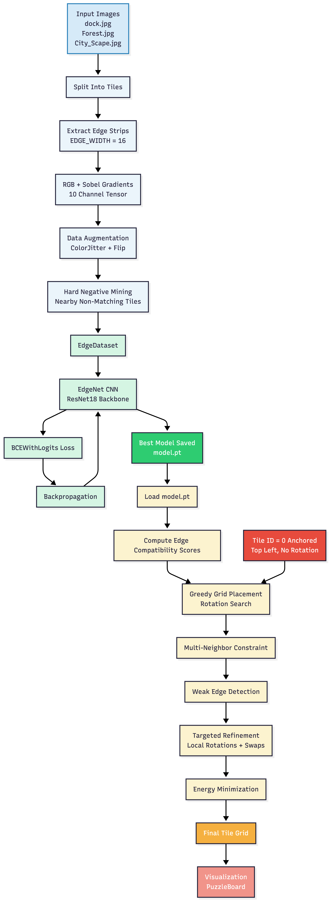
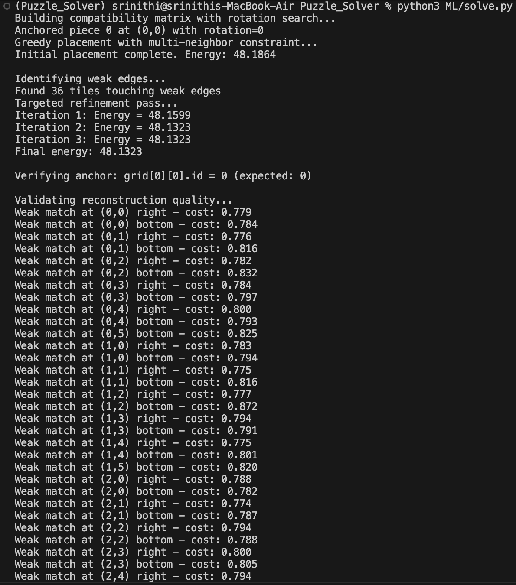
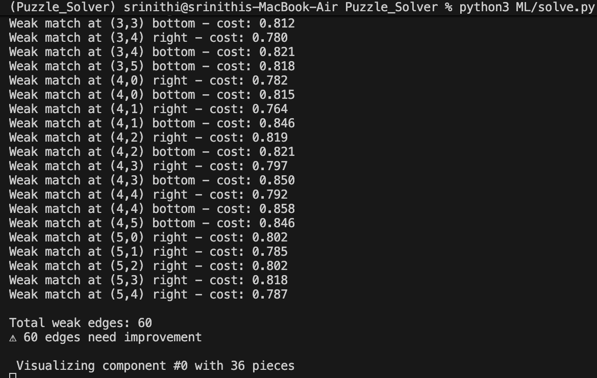

# ML-Based Puzzle Reconstruction

## Overview

I designed and implemented an end-to-end Machine Learning pipeline to reconstruct a shuffled and rotated image composed of square tiles.

The core idea of my approach is to treat puzzle reconstruction as an **edge compatibility prediction problem**. I trained a deep convolutional model (EdgeNet) to learn whether two tile edges belong together by analyzing RGB texture continuity and Sobel gradient features. Using these learned compatibility scores, I built a custom solver that incrementally assembles the puzzle while minimizing a global energy function.

My solution consists of:

- A data pipeline that generates positive and hard negative edge pairs directly from the provided images  
- An EdgeNet CNN model based on ResNet-18 for edge compatibility prediction  
- A greedy placement algorithm with rotation search and multi-neighbor constraints  
- A targeted refinement stage that detects weak edges and performs local swaps and rotations  
- A global energy minimization strategy to improve reconstruction consistency  

The full pipeline supports both training and inference, producing a reconstructed image from shuffled tiles.

All constraints from the problem statement are respected:

- Tile ID = 0 is permanently anchored at the top-left corner and never rotated  
- Only the three provided images are used for training  
- Tiles may be arbitrarily shuffled and rotated during inference  

This design demonstrates how learned local edge relationships can be combined with classical optimization techniques to solve a structured visual reconstruction problem.


## High-Level Architecture



## Components

### 1. Edge Dataset (`edge_dataset.py`)

Responsible for creating training samples.

For each tile:

- Extract edge strips (16px width)
- Compute Sobel X/Y gradients
- Concatenate RGB + gradients (10 channels)
- Generate:
  - Positive samples (true neighbors)
  - Negative samples (non-neighbors)

This produces supervised data for learning edge compatibility.


### 2. Edge Compatibility Model (`edge_model.py`)

A CNN classifier called **EdgeNet**.

Architecture:

- ResNet18 backbone
- Modified first convolution to accept 10 channels
- Fully connected head:

```
512 → 256 → 128 → 1
```
.

Includes:

- BatchNorm
- ReLU
- Dropout

Output:

- Single logit indicating probability that two edges belong together.

Loss:

- BCEWithLogitsLoss

Optimizer:

- Adam


### 3. Training (`train.py`)

Pipeline:

1. Load EdgeDataset
2. Train EdgeNet
3. Track best validation loss
4. Save best model as `model.pt`
5. Early stopping with patience

Command:

```
python ML/train.py
```


### 4. Solver (`solve.py`)

Responsible for assembling the puzzle.

Steps:

#### a) Tile Preparation

- Split input image into GRID × GRID tiles
- Extract edges
- Generate rotated variants (0°, 90°, 180°, 270°)


#### b) Anchoring

Tile with ID = 0 is permanently fixed at position (0,0).


#### c) Edge Scoring

Each candidate placement is evaluated using:

```
Total Cost = 0.8 * (1 - CNN score) + 0.2 * L2 pixel distance
```

This combines:

- Learned compatibility
- Raw pixel similarity

#### d) Greedy Placement

Tiles are placed left-to-right, top-to-bottom.

Each position evaluates:

- Left neighbor (if exists)
- Top neighbor (if exists)

Lowest total cost wins.

Rotation is optimized per tile.


#### e) Weak Edge Detection

After initial placement:

- All adjacent edges are evaluated
- Any cost > threshold is marked "weak"
- Tiles touching weak edges are collected


#### f) Targeted Refinement

For tiles touching weak edges:

- Try local rotations
- Try swapping with neighbors
- Accept changes only if global energy decreases

Energy = sum of all adjacent edge costs.


### Energy Function

Grid energy is defined as:

Sum of all adjacent edge costs.

Lower energy indicates better reconstruction.


## Execution

### Train model

```
python ML/train.py
```

Produces:

```
model.pt
```


### Solve puzzle

```
python ML/solve.py
```

Outputs:

- Reconstructed image visualization
- Energy score
- Weak edge diagnostics




## Reproducibility

Environment:

- Python 3.11.7
- PyTorch
- torchvision
- OpenCV
- NumPy

To reproduce results:
- python create_virtual_env.py
- python ML/train.py
- python ML/solve.py

All experiments strictly use only the three provided images, per assignment constraints.

## Results

Here's the reconstructed image produced by the trained model:


Current system performs:

- Successful anchoring of tile 0
- Rotation-aware placement
- Full reconstruction pipeline
- Edge confidence validation
- Local refinement

Remaining limitations:

- Some weak edges persist due to:
  - Extremely small dataset (3 images)
  - Texture ambiguity (water / foliage)
  - Limited negative diversity

Despite this, the pipeline demonstrates:

- End-to-end ML-driven reconstruction
- Learned edge semantics
- Global consistency optimization

While reconstruction is generally coherent, some weak edges remain due to limited training data and texture ambiguity. With larger training sets, these inconsistencies would likely diminish.

## Key Design Decisions

### 1. Framing Reconstruction as Edge Compatibility Learning
Instead of directly predicting tile positions, I decomposed the problem into learning local edge compatibility. This makes the solution modular and scalable to larger grids.

### 2. Hybrid Scoring (ML + Pixel Distance)
Pure CNN confidence can be noisy with limited data. I combined:
- Learned compatibility score (80%)
- Raw L2 pixel similarity (20%)

This improves robustness when textures are ambiguous.

### 3. Multi-Neighbor Constraint
When both left and top neighbors exist, the candidate tile must satisfy both simultaneously. This reduces local greedy errors and enforces spatial consistency.

### 4. Weak Edge Refinement
Rather than global re-optimization, I used targeted local refinement focusing only on problematic regions, improving efficiency while maintaining quality.

### 5. Sobel Gradient Features
To improve edge continuity detection, I augmented RGB channels with normalized Sobel X/Y gradients, allowing the model to learn structural continuity beyond color similarity.

## Computational Complexity

Let N = number of tiles (GRID × GRID)

Training:
- O(E) edge pair generation
- CNN forward/backward pass per batch

Inference:
- Compatibility scoring: O(N² × 4 rotations)
- Greedy placement: O(N² × rotations)
- Refinement: Local search over weak-edge subset

For GRID = 6 (36 tiles), runtime is fully manageable on CPU.
The approach scales moderately but would require pruning for large N.

## Future Improvements

If more data were available:

- Contrastive loss instead of BCE
- Hard negative mining at dataset level
- Directional edge classifiers (top/bottom/left/right)
- Graph optimization (Hungarian / ILP)
- Larger backbone (ResNet34 / ConvNeXt)
- Global refinement (simulated annealing)

These were intentionally avoided to keep solution aligned with assignment scope.


## Summary of My Contribution

I implemented:

- Custom EdgeDataset with gradient features
- EdgeNet CNN model
- Full training pipeline
- Rotation-aware greedy solver
- Multi-neighbor cost evaluation
- Weak-edge detection
- Targeted refinement loop
- Energy-based validation
- ML subsystem integration into provided puzzle framework

This converts the original procedural puzzle code into a learning-based reconstruction system.


**Author: Srinithi J**